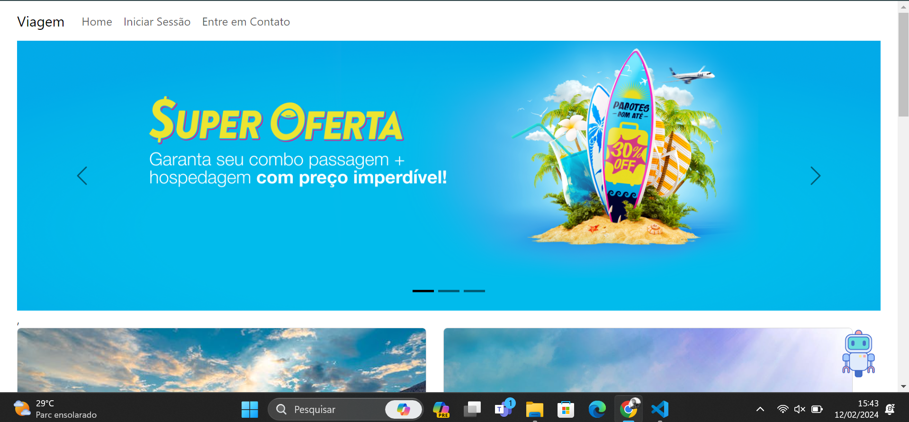
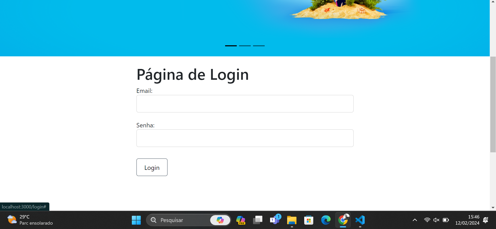
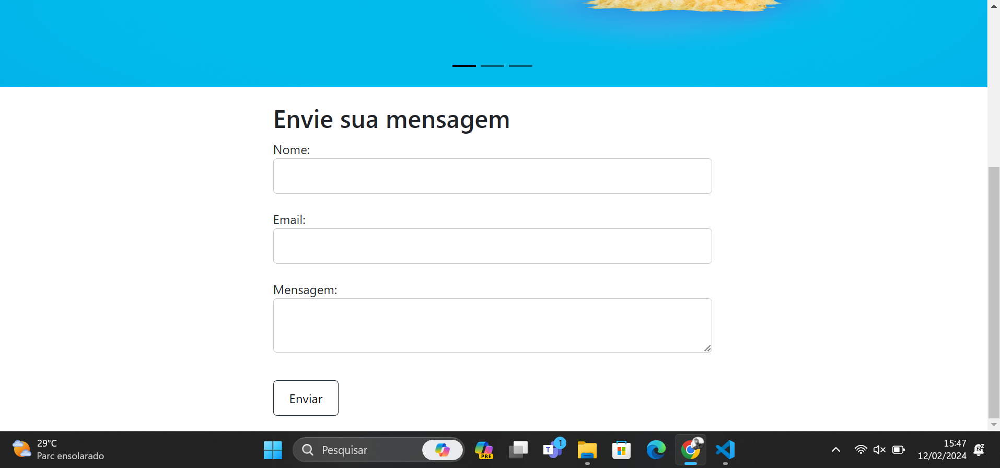

This is a [Next.js](https://nextjs.org/) project bootstrapped with [`create-next-app`](https://github.com/vercel/next.js/tree/canary/packages/create-next-app).

## Getting Started

First, run the development server:

```bash
npm run dev
# or
yarn dev
# or
pnpm dev
# or
bun dev
```

Open [http://localhost:3000](http://localhost:3000) 

# agencia-de_viagem_recode
criado com Reactjs,Bootstrap e nextjs
## Olá pessoal 👋
- 😄 Feito com Carinho por mim: Isaac Felipe
- ⚡ explore o que eu construir durante o aprendizado com as aulas do Professor Caique
- Página Inicial do Site: 


- Página de Login:



- Página de Enviar Mensagem:

